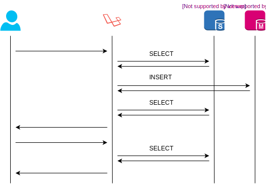
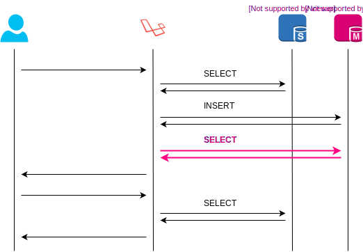
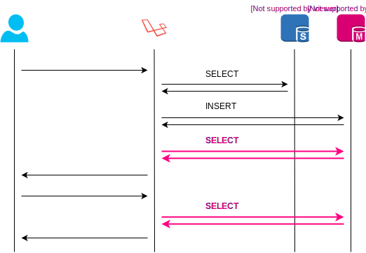

# Laravel Cached Database Stickiness<br>[](https://travis-ci.org/mpyw/laravel-cached-database-stickiness) [](https://coveralls.io/github/mpyw/laravel-cached-database-stickiness?branch=master) [](https://scrutinizer-ci.com/g/mpyw/laravel-cached-database-stickiness/?branch=master)

Guarantee database stickiness over the same user's consecutive requests.

## Requirements

- PHP: ^7.1
- Laravel: ^5.8 || ^6.0 || ^7.0 

## Installing

```bash
composer require mpyw/laravel-cached-database-stickiness
```

The default implementation is provided by `ConnectionServiceProvider`, however, **package discovery is not available**.
Be careful that you MUST register it in **`config/app.php`** by yourself.

```php
<?php

return [

    /* ... */

    'providers' => [

        /* ... */

        Mpyw\LaravelCachedDatabaseStickiness\ConnectionServiceProvider::class,

        /* ... */

    ],

    /* ... */
];
```

Then select the proper cache driver:

| Driver | Is eligible? | Description |
|:---|:---:|:---|
| **`redis`** | 😄 | Very fast, scalable and reliable driver | 
| **`memcached`** | 😄 |  Alternative for Redis | 
| `dynamodb` | 😃 |  It works but not so suitable for short-term caching |
| `apc` | 😧 | It works unless PHP processes are running in multiple machines or containers | 
| `file` | 😧 | It works unless PHP processes are running in multiple machines or containers |
| <del>`database`</del> | 🤮 | We'll get into a chicken-or-egg situation |
| <del>`array`</del> | 🤮 | Just for testing |

## Features

This library provides the following features.

- Make HTTP server to take over the database sticky state from the previous user's request within the last 5 seconds.
- Make queue worker into referring to master by default. 
- Make queue worker into referring to slave by implementing `ShouldAssumeFresh` on your Queueable (jobs, listeners, notifications and mailables).

## Diagrams

### Default



### Sticky



### Sticky Cached



## Advanced Usage

### Customize Stickiness TTL

The default stickiness TTL is `5` seconds.
You can configure this value to add **`stickiness_ttl`** directive to your `config/database.php`.

```php
<?php

return [

    /* ... */

    'default' => env('DB_CONNECTION', 'mysql'),

    /*
    |--------------------------------------------------------------------------
    | Database Connections
    |--------------------------------------------------------------------------
    |
    | Here are each of the database connections setup for your application.
    | Of course, examples of configuring each database platform that is
    | supported by Laravel is shown below to make development simple.
    |
    |
    | All database work in Laravel is done through the PHP PDO facilities
    | so make sure you have the driver for your particular database of
    | choice installed on your machine before you begin development.
    |
    */

    'connections' => [

        /* ... */

        'mysql' => [
            'read' => env('DB_HOST_READONLY') ? [
                'host' => env('DB_HOST_READONLY'),
            ] : null,
            'write' => [],
            'sticky' => true,
            'stickiness_ttl' => 3, // Set the stickiness TTL to 3 seconds
            'driver' => 'mysql',
            'host' => env('DB_HOST', '127.0.0.1'),
            'port' => env('DB_PORT', '3306'),
            'database' => env('DB_DATABASE', 'forge'),
            'username' => env('DB_USERNAME', 'forge'),
            'password' => env('DB_PASSWORD', ''),

            /* ... */
        ],

    ],
    
];
```

### Customize Connection Implementation

You can configure Connection implementation.

- Make sure `ConnectionServiceProvider` to be removed from `config/app.php`.
- Extend Connection with `DispatchesConnectionEvents` trait by yourself.

```php
<?php

namespace App\Providers;

use App\Database\MySqlConnection;
use Illuminate\Database\Connection;
use Illuminate\Support\ServiceProvider;

class DatabaseServiceProvider extends ServiceProvider
{
    public function register(): void
    {
        Connection::resolverFor('mysql', function (...$parameters) {
            return new MySqlConnection(...$parameters);
        });
    }
}
```

```php
<?php

namespace App\Database;

use Illuminate\Database\Connection as BaseMySqlConnection;
use Mpyw\LaravelCachedDatabaseStickiness\DispatchesConnectionEvents;

class MySqlConnection extends BaseMySqlConnection
{
    use DispatchesConnectionEvents;
}
```

### Customize Stickiness Source

You can register the `StickinessResolverInterface` implementation to change the source for stickiness determination.

```php
<?php

namespace App\Providers;

use Illuminate\Support\ServiceProvider;
use Mpyw\LaravelCachedDatabaseStickiness\StickinessResolvers\AuthBasedResolver;
use Mpyw\LaravelCachedDatabaseStickiness\StickinessResolvers\StickinessResolverInterface;

class DatabaseServiceProvider extends ServiceProvider
{
    public function register(): void
    {
        $this->app->bind(StickinessResolverInterface::class, AuthBasedResolver::class);
    }
}
```

| | Source | Middleware |
|:---:|:---:|:---:|
| `IpBasedResolver`<br>**(Default)**| Remote IP address | |
| `AuthBasedResolver` | Authenticated User ID | Required |

You must add **`ResolveStickinessOnResolvedConnections`** middleware after `Authenticate`
when you use `AuthBasedResolver`.

```diff
--- a/app/Http/Kernel.php
+++ b/app/Http/Kernel.php
 <?php
 
 namespace App\Http;
 
 use Illuminate\Foundation\Http\Kernel as HttpKernel;
 
 class Kernel extends HttpKernel
 {
     /* ... */
 
     /**
      * The application's route middleware groups.
      *
      * @var array
      */
     protected $middlewareGroups = [
         'web' => [
             \App\Http\Middleware\EncryptCookies::class,
             \Illuminate\Cookie\Middleware\AddQueuedCookiesToResponse::class,
             \Illuminate\Session\Middleware\StartSession::class,
             // \Illuminate\Session\Middleware\AuthenticateSession::class,
             \Illuminate\View\Middleware\ShareErrorsFromSession::class,
             \App\Http\Middleware\VerifyCsrfToken::class,
             \Illuminate\Routing\Middleware\SubstituteBindings::class,
         ],
 
         'api' => [
             'throttle:60,1',
             \Illuminate\Routing\Middleware\SubstituteBindings::class,
         ],
+
+        'auth' => [
+            \App\Http\Middleware\Authenticate::class,
+            \Mpyw\LaravelCachedDatabaseStickiness\Http\Middleware\ResolveStickinessOnResolvedConnections::class,
+        ],
+
+        'auth.basic' => [
+            \Illuminate\Auth\Middleware\AuthenticateWithBasicAuth::class,
+            \Mpyw\LaravelCachedDatabaseStickiness\Http\Middleware\ResolveStickinessOnResolvedConnections::class,
+        ],
     ];
 
     /**
      * The application's route middleware.
      *
      * These middleware may be assigned to groups or used individually.
      *
      * @var array
      */
     protected $routeMiddleware = [
-        'auth' => \App\Http\Middleware\Authenticate::class,
-        'auth.basic' => \Illuminate\Auth\Middleware\AuthenticateWithBasicAuth::class,
         'bindings' => \Illuminate\Routing\Middleware\SubstituteBindings::class,
         'cache.headers' => \Illuminate\Http\Middleware\SetCacheHeaders::class,
         'can' => \Illuminate\Auth\Middleware\Authorize::class,
         'guest' => \App\Http\Middleware\RedirectIfAuthenticated::class,
         'password.confirm' => \Illuminate\Auth\Middleware\RequirePassword::class,
         'signed' => \Illuminate\Routing\Middleware\ValidateSignature::class,
         'throttle' => \Illuminate\Routing\Middleware\ThrottleRequests::class,
         'verified' => \Illuminate\Auth\Middleware\EnsureEmailIsVerified::class,
     ];
 
     /* ... */
 }
```

### Customize Worker Behavior

You can register the `JobInitializerInterface` implementation to change workers' behavior.

```php
<?php

namespace App\Providers;

use Illuminate\Support\ServiceProvider;
use Mpyw\LaravelCachedDatabaseStickiness\JobInitializers\AlwaysFreshInitializer;
use Mpyw\LaravelCachedDatabaseStickiness\JobInitializers\JobInitializerInterface;

class DatabaseServiceProvider extends ServiceProvider
{
    public function register(): void
    {
        $this->app->bind(JobInitializerInterface::class, AlwaysFreshInitializer::class);
    }
}
```

| | General Queueable | `ShouldAssumeFresh` Queueable | `ShouldAssumeModified` Queueable |
|:---:|:---:|:---:|:---:|
| `AlwaysModifiedInitializer`<br>**(Default)**| Master | **Slave** | Master |
| `AlwaysFreshInitializer` | Slave | Slave | **Master** |
